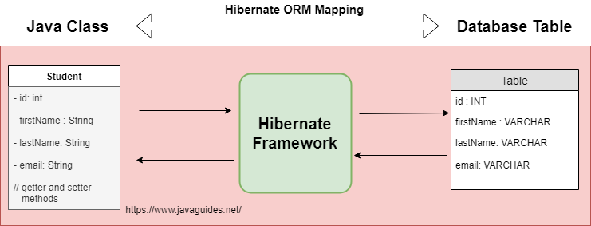
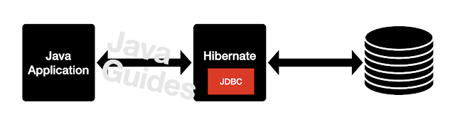

- [JavaGuide-Hibernate](https://www.javaguides.net/p/hibernate-tutorial.html)

---

Table of Content : 

- [Hibernate Notes](#hibernate-notes)
    - [How does Hibernate relate to JDBC?](#how-does-hibernate-relate-to-jdbc)
    - [What are the important benefits of using the Hibernate Framework?](#what-are-the-important-benefits-of-using-the-hibernate-framework)
    - [What are the advantages of Hibernate over JDBC?](#what-are-the-advantages-of-hibernate-over-jdbc)

# Hibernate Notes

- ORM - Object Relational Mapping
	Domain Model Object to Relational Database Tables

- Hibernate is a Java-based ORM tool that provides a framework for mapping application domain objects to relational database tables and vice versa.

### How does Hibernate relate to JDBC?

### What are the important benefits of using the Hibernate Framework?

- Code Efficiency
- Flexibility in Code:
- Advanced Query Capabilities
  - HQL
- Community and Documentation
- Integeration with JavaEE Framework
  - Notably Spring
- Performance Optimization
  - Lazy Loading
  - Caching Mechanisms
- Vendor Specific Features
- Compreshensive ORM Tool

### What are the advantages of Hibernate over JDBC?

- Simplified Code
- Advanced Mapping Features
- Transaction Management
- Exception Handling
- Object-Oriented Query Language
- Caching For Performance
- Database Synchronization
- Flexible Connection Management
- ORM Tool Independence

---
https://www.javaguides.net/2018/11/hibernate-hello-world-tutorial.html
https://github.com/RameshMF/Hibernate-ORM-Tutorials/tree/master/hibernate-helloworld-example
